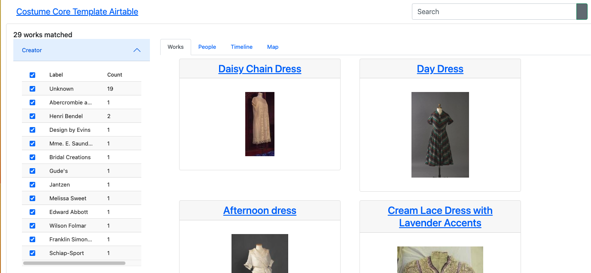
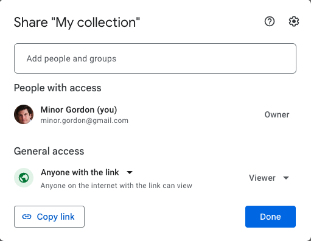
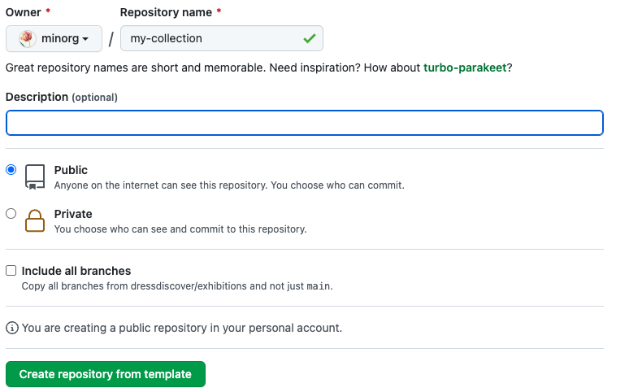
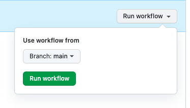
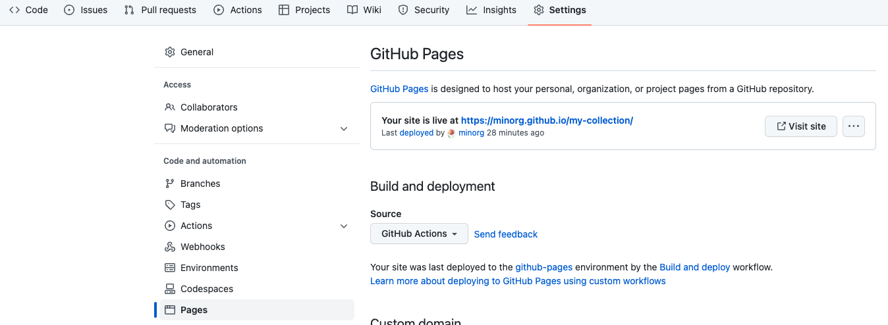

# Generate a faceted search interface for data in Google Sheets

The tutorial will guide you in creating a web-based faceted search interface for your collection data.

You will:
* Enter collection metadata/data in [Google Sheets](https://www.google.com/sheets/about/)
* Generate a website from the collection data using [GitHub Actions](https://github.com/features/actions)
* Deploy the site using [GitHub Pages](https://pages.github.com/)

The end result will look like:

## Before you start

For this tutorial you will need:

* A [Google account](https://support.google.com/accounts/answer/27441?hl=en) to access Google Sheets
* A [GitHub account](https://github.com/join) to create a GitHub repository, set up GitHub Actions, and deploy your generated website using GitHub Pages

You do not need to install git or any other software on your computer.

## Create and configure a Google Sheet

The following steps assume you have created a Google account and are logged in to it.

### Copy the template Google Sheet

Create a new Google Sheet by copying [this template](https://docs.google.com/spreadsheets/d/1j2oaMvMxY4pnXO-sEH_fky2R2gm6TQeIev_Q8rVOD4M/edit?usp=sharing).

We'll call the copy "My collection" and save it in your Google Drive. Leave the "Share it with the same people" and "Copy comments" boxes unchecked. When you're done typing the name of the copy, click "Make a Copy".

### Share the new Google Sheet

You will need to make your new Google Sheet publicly available to anyone with the link:

1. Click the "Share" button in the upper right-hand corner
2. Change the "General access" dropdown to "Anyone with the link" and leave it as "Viewer".
3. Click the "Done" button.

## Create and configure a GitHub repository

The following steps assume you have created a GitHub account and are logged in to it.

### Copy the template GitHub repository

Navigate to the [template repository](https://github.com/dressdiscover/exhibitions) and click the "Use this template button".

Click "Create a new repository". You can name the repository as you wish. We'll call it "my-collection" here.

When you're done typing in the name of your repository, click the "Create repository from template" button.

### Configure GitHub Pages

On your new GitHub repository, click the "Settings" button in the list of tabs under your collection name. On the "Settings" page, click "Pages" in the sidebar navigation to configure GitHub Pages.

Under "Build and deployment" -> "Source", select "GitHub Actions" from the dropdown.

### Configure the Paradicms app

Navigate back to the "Code" tab of your GitHub repository.

Click on `app-configuration.ttl`.

Then click the edit (pencil) button.

On the editing screen, edit the basePath to be "/my-collection".

When you're done, scroll to the bottom of the screen and click the "Commit changes" button.

### Configure GitHub Actions

Navigate back to the "Code" tab. From there:

1. Select the `.github/workflows` folder
2. Select the `build.yml` file.
3. Edit the file by clicking the pencil button.

Find the URL of your Google Sheet. That's the `docs.google.com` in the address bar of your browser tab.

In the `build.yml` YAML editor on GitHub, change the "spreadsheet" value to the URL of your spreadsheet.

When you're done, click the "Start commit" button on the right, then the "Commit changes" button.

## Generate the site

On your GitHub repository, navigate to the "Actions" tab, then select the "Build and deploy" action in the left sidebar.

Click the "Run workflow" button on the right. You don't need to change the "Use workflow" branch. Simply click the "Run workflow" button.

You will see a new workflow run like the following:

GitHub is using Paradicms to generate a website from your Google Sheet. You will "Run workflow" to re-generate the site whenever you change your Google Sheet.

## Navigate to your site

Once the workflow has completed, the status icon beside it will turn into a green checkmark.

Your site is now available on GitHub Pages. The address is a combination of your GitHub username/organization and the name of the repository. For example, if your username is `minorg` and the repository is `my-collection`, the site will be

[https://minorg.github.io/my-collection/](https://minorg.github.io/my-collection/)

Alternatively, you can find the site address on the GitHub Pages configuration on your GitHub repository. Navigate to the "Settings" tab, then to "Pages" in the left sidebar, as before. From there you can click the "Visit site" button.

## Next steps: enter your collection data in Google Sheets

Your new Google Sheet contains example collection data copied from teh template. When you are ready, clear this data (rows 2+) in each sheet, and proceed to the tutorial on [editing collection data in a spreadsheet](./edit-spreadsheet).
